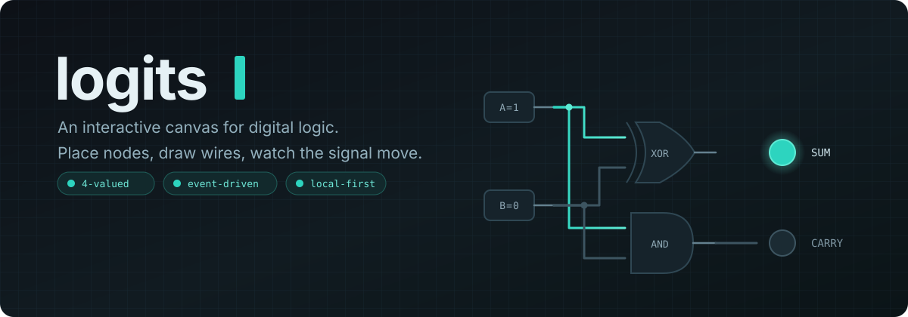
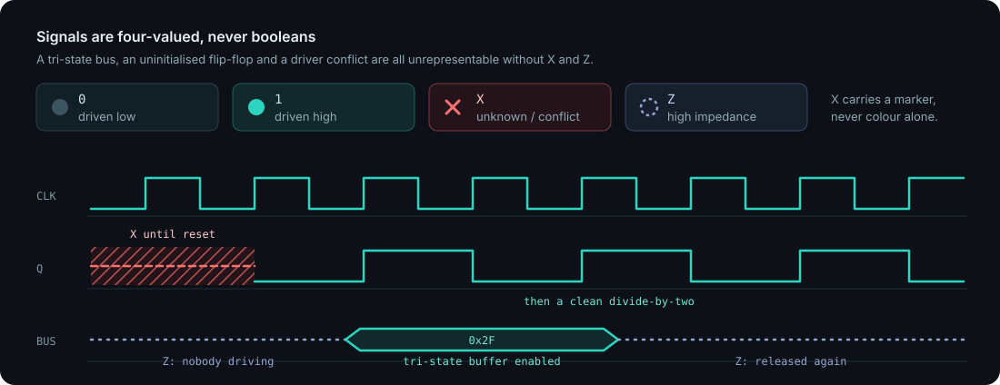
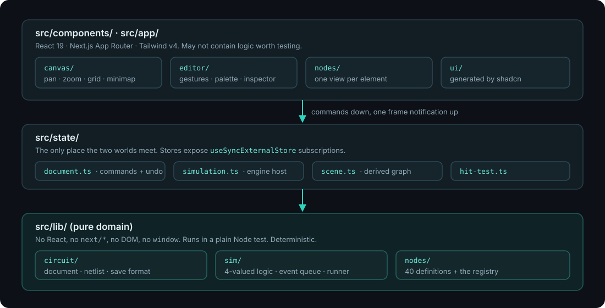
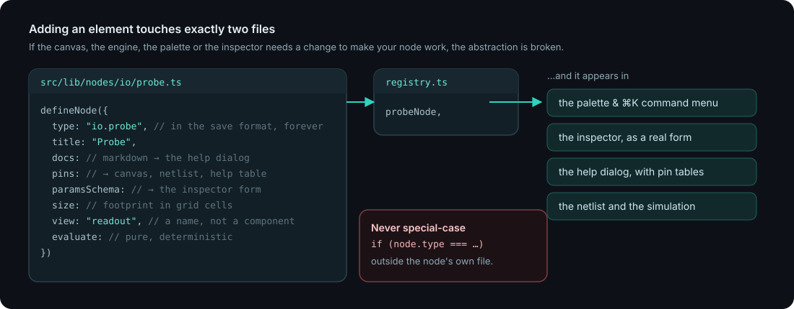

<div align="center">



### [**logits.nexul.in**](https://logits.nexul.in)

No install, no account, nothing to save to a server.

</div>

---

**Logits** is a browser app for designing and simulating digital logic on an
infinite canvas. Drag a gate out of the palette, click one pin then another to
wire it, flip a switch, and watch the signal actually propagate, in simulated
nanoseconds, through an event-driven engine.

It is not a picture of a circuit. It is the circuit.

```
40 element types   ·   9 categories   ·   4-valued signals   ·   buses up to 64 bits
```

## What you get

| | |
| --- | --- |
| **Everything is a node** | Gates, switches, clocks, flip-flops, counters, muxes, ALUs, ROM/RAM, splitters, tunnels, scopes, 7-segment and hex displays. All 40 come from the same definition contract, and none of them is special-cased anywhere in the app. |
| **Real timing** | Gates have propagation delay. Clocks drive edges. An oscilloscope records transitions on a ring buffer and draws the waveform on the canvas, next to the circuit making it. |
| **Four-valued logic** | `0`, `1`, `X` (unknown or conflict) and `Z` (floating). Tri-state buses, uninitialised flip-flops and driver conflicts are things you can see rather than things that silently become zero. |
| **Wires that behave** | Free-angle routing drawn click by click, bends you can grab and move, branches pulled off an existing wire. Each lands as one undo step. |
| **Deterministic** | No `Math.random`, no wall-clock reads in the engine. The same circuit and the same inputs produce the same waveform every single run. |
| **Local-first** | A circuit is a plain JSON document. It round-trips through `localStorage`, export and import. There is no backend and no account. |
| **Help where you are** | Every element carries its own Markdown docs, and the pin and setting tables in the help dialog are *derived* from the definition, so they cannot drift from what the node actually does. |

## Signals



A signal is never a boolean and never a number bitmask. `X` gets a marker, not
just a colour. The same rule holds everywhere in the UI, so state is never
communicated by colour alone.

## Try it without building anything

[**logits.nexul.in**](https://logits.nexul.in) ships seven worked circuits in
the sidebar. They open fully editable and simulatable, but are never written to
storage, so break one freely, or import it into a project of your own.

| Example | What it shows |
| --- | --- |
| Gate sampler | Every basic gate driven by the same two switches |
| Half adder | Two bits in, sum and carry out |
| Full adder | Two half adders and an OR, carry chained |
| 2→1 mux | Select picks which input reaches the output |
| SR latch | Cross-coupled NOR gates that remember a bit |
| Master-slave flip-flop | Two latches in series, clocked on opposite edges |
| Tri-state bus | Two drivers sharing one net, with `Z` and `X` |

## Getting around

| Gesture | Action |
| --- | --- |
| Wheel / two-finger scroll | Pan · `Ctrl`/`Cmd` + wheel or pinch zooms at the pointer |
| Click a palette element, then the canvas | Place it. Click the entry again to arm more copies, and up to 6 land as one undo step |
| `Ctrl`/`Cmd` + `K` | Command menu; places at the last pointer position |
| Click a pin, then a second pin | Wire them. Clicks on empty canvas in between drop bends. `Esc` cancels |
| Right-click a wire and drag | Branch a new wire from that point |
| Drag a wire, or drag a bend handle | Add or move a bend. Drop a bend on its neighbour to straighten |
| `Space` (tap) / `.` | Play–pause / single step |
| `R` · `Ctrl+D` · `Ctrl+Z` | Rotate · duplicate · undo |
| `Tab`, then `Enter` on a pin | Wire from the keyboard, because nodes and pins are real focusable DOM |
| `Ctrl`/`Cmd` + `B` · `Ctrl`/`Cmd` + `J` | Toggle the projects and elements sidebars |

The full list, including the touch gestures, is in
[artifacts/07-interaction-spec.md](artifacts/07-interaction-spec.md).

## Running it locally

Requires [Bun](https://bun.sh). Use `bun`, not npm or pnpm.

```bash
bun install
bun run dev      # http://localhost:3000
```

```bash
bun run test     # vitest, node environment
bun run lint     # biome check
bun run build    # run this before claiming a change compiles
```

## How it is put together



Three layers, and the direction of the arrows is the whole design:

- **`src/lib/`** is pure. No React, no `next/*`, no DOM, no `window`. It runs
  in a plain Node test, which is why the 30 test files can simulate a ring
  oscillator or an SR latch headlessly.
- **`src/state/`** is the only place the two worlds meet. Document mutations go
  through commands, so undo and autosave have exactly one hook. The simulation
  never drives React state per event: it notifies once per frame, and components
  subscribe per net through `useSyncExternalStore`.
- **`src/components/`** draws. Nodes are DOM (so they are focusable, labelled
  and reachable by keyboard), wires are one SVG layer, and there is exactly one
  pan/zoom implementation for everything to build on.

Read [artifacts/02-architecture.md](artifacts/02-architecture.md) before moving
a file across a boundary, and the [ADRs](artifacts/decisions/) for why any of it
is the way it is.

## Adding an element



A definition file under `src/lib/nodes/`, and one line in
`src/lib/nodes/registry.ts`. That is the entire change:

```ts
export const probeNode = defineNode({
  type: "io.probe",          // part of the save format, stable forever
  title: "Probe",
  category: "io",
  docs: `A numeric readout of a whole bus, in the radix you choose. …`,
  defaultParams: { width: 1, radix: "binary" },
  view: "readout",           // a name, not a component: this layer can't import React
  paramsSchema: [
    { key: "width", label: "Bit width", kind: "int", min: 1, max: 64 },
    { key: "radix", label: "Radix", kind: "select", options: [/* … */] },
  ],
  pins: (params) => [
    { id: "in", name: "IN", direction: "in",
      width: intParam(params, "width", 1), side: "left", offset: 2 },
  ],
  size: () => ({ width: 6, height: 4 }),
});
```

The palette, the command menu, the inspector form, the help dialog, the netlist
and the simulation all pick it up from there. If you find yourself editing the
canvas, the engine or the inspector to make an element work, the abstraction is
broken, so fix that instead. Start with
[artifacts/05-node-authoring-guide.md](artifacts/05-node-authoring-guide.md).

## Deliberately out of scope

Analog and transistor-level simulation. HDL import/export. Real-time
collaboration. Accounts, a backend, a database. Logits is a logic canvas, not a
schematic-capture tool and not a teaching platform.

## Documentation

Design docs live in [`artifacts/`](artifacts/) and are the source of truth for
*intent*; `src/` is the source of truth for *what exists*. Start at
[artifacts/README.md](artifacts/README.md); [the roadmap](artifacts/08-roadmap.md)
carries the current phase and an honest list of known issues.

Built with Next.js 16, React 19, TypeScript strict, Tailwind v4 and Bun.
